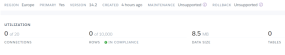
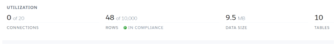

# Family Favourites – Deployment Details

[View README.md file.](/README.md)

[View Family Favourites deployed site here.](add link)

## Deployment

## Table of Contents

- [Deployment Procedure](#deployment-procedure)
- [How to Clone the Repository](#how-to-clone-the-repository)
- [How to Fork the Repository](#how-to-fork-the-repository)

****

## Deployment Procedure

How to set up a Django project and deploy it to Heroku.

### 1. Create a workspace and repository

- Create a folder project on your computer in file explorer and inside VSCode open the project workspace you just created.
- Create a virtual environment with Python v3.12.10 on VSCode. Add a .gitignore file to your workspace at the root level and add the .venv/ folder to the .gitignore.
- Create a repository in GitHub with your project name, then copy ‘create the new repository on the command line’ and paste in the command line in VSCode and enter.

### 2. Install Django and supporting libraries

- Install Django and Gunicorn (Gunicorn is the server that will be used to run Django on Heroku) with the following command in the terminal:

```bash
pip3 install Django==4.2.0 gunicorn 
```

- Install the main Django supporting libraries required to get the project running the library for PostgreSQL with the following command in the terminal:

```bash
pip3 install dj_database_url psycopg2 
```

- Install library for Cloudinary for storage with the following command in the terminal:

```bash

pip3 install dj3-cloudinary-storage 
```

- Create the requirements.txt file which will add all the above installed packages to the file with the following command in the terminal:

```bash
pip3 freeze --local > requirements.txt 
```

### 3. Create a project directory and project applications

- Create a project directory (root app) entering the desired project name at the end of the command followed by a space and a full stop in the terminal:

```bash
django-admin startproject PROJ_NAME . 
```

This will create a project directory in the main directory. This project directory will contain a settings.py file and a urls.py file along with other files. In the main directory, a manage.py file will also be created.

- Create project apps entering the desired project app name at the end of the command with the following command in the terminal:

```bash
python3 manage.py startapp APP_NAME 
```

This will create an app in the main directory, at the same level as the root directory.

- In the `settings.py` add the app name at the bottom of the `INSTALLED_APPS` list and enclosed between a pair of single quotes, with a comma at the end.

```bash
INSTALLED_APPS = [
    ‘APP_NAME’,
]
```

- Save the changes.

### 4. Migrate changes to the database

- The very first migration will contain a list of migration files from the django built-in apps (e.g. authentication and admin) that need migrating to the database with the following command in the terminal:

```bash
python3 manage.py migrate 
```

__Note:__ The following commands can be used to display migration file information before we submit anything to the database:

- The showmigrations command shows what migrations need to be submitted to the database with the following command in the terminal:

```bash
python3 manage.py showmigrations 
```

- To do a practice run to show what migrations we have if we ran makemigrations in real life with the following command in the terminal:

```bash
python3 manage.py makemigrations --dry-run
```

- If we make changes to an app model, we should run a ‘makemigrations’ command with the following command in the terminal:

```bash
python3 manage.py makemigrations 
```

- Now you can run the migrate with the following command in the terminal:

```bash
Python3 manage.py migrate 
```

___Note:__ After running this command – any migrations that were displaying with an empty square bracket (e.g. [ ]), will now display with a cross (e.g. [X]), when the showmigrations command is run after the migrate command. This indicates that these migrations have been made to the database.

- Run the project on the server to test it is working with the following command in the terminal:

```bash
 python3 manage.py runserver 
```

- Open the browser on port 8000, it should open up a screen that displays that the “install worked successfully”. To open hold down the ctrl key + click on the link - `http://127.0.0.1:8000/`.

### 5. Create and set up a Heroku app

- Login in with your Heroku email and password at [Heroku](https://heroku.com) or create an account if needed:
- In the dashboard, click on `new` button and select `create new app`.
- Add an `APP_NAME`, then select the location, and then click `create app` button.
- Connect a server-based relational database to the Heroku app - click on the `Resources`tab.
- In the `add-ons` box search for ‘Heroku Postgres’ and select it.
- A pop-up box will appear to confirm the installation of Heroku Postgres in your app – select `submit order form`. Heroku Postgres will now appear in the `add-ons` list.
- Click on the `Settings` tab and scroll to `Config Vars` then click on `Reveal Config Vars` to retrieve our database URL.
- Next to the `config var` called ‘DATABASE_URL’ copy the Postgres URL to add into our project in VSCode.

### 6. Create and set up an env.py file

- In the VSCode, create a new file called `env.py` at the top level directory. This file will store our secret environment variables (make sure the `env.py` is added to the `.gitignore` file).
- In the env.py, import the os library at the top of the file by typing the following into the file:

```bash
import os 
```

- Set up environment variables by typing the following into the file:

```bash
os.environ.setdefault (
    "DATABASE_URL",
    ("Paste in Heroku DATABASE_URL Link" )
)
```

- Create and add a secret key to encrypt session cookies. This should also not be visible on GitHub – type the following into the file:

```bash
os.environ.setdefault (
    "SECRET_KEY",
    ("Paste in your own randomSecretKey" )
)
```

- Save all the changes in the env.py file.

### 7. Update config vars in Heroku app with secret key

- In the Heroku app, click on the `Settings` tab and scroll to `Config Vars` then click on `Reveal Config Vars`.
- Type the following in the `Key` as: `SECRET_KEY`.
- For the `Value` - Copy and paste the secret key created in VSCode.
- Click `Add` – once both entries have been made.

### 8. Update root app with secret key and database

- In VSCode, open the `settings.py` file from the root app and navigate to where it says - `from pathlib import Path`.
- Directly below this import, add the following code:

```bash
import os 
import dj_database_url 
if os.path.isfile("env.py"): 
import env 
```

- Update the `SECRET_KEY` value in the `settings.py` file, with:

```bash
SECRET_KEY=os.environ.get('SECRET_KEY') 
```

- Navigate to the `DATABASES` section and highlight all of the section and comment it out (using ctrl + /)
- Add a new `DATABASES` section – as below:

```bash
DATABASES = { 
    'default': dj_database_url.parse(os.environ.get(‘DATABASE_URL’)) 
} 
```

- To test the root app has been linked to the database - open the Heroku app > Resources > Heroku Postgres – should say that there are zero tables/rows



- Now you can run the migrate with the following command in the terminal. All the initial Django built apps will migrate again – but this time to the Heroku Postgres database rather than the sqlite3 database on VSCode.

```bash
python3 manage.py migrate 
```

- Refresh the ‘Heroku Postgres’ page in Heroku – it should now show that there are more tables and rows. This shows our GitHub project is now connected to the Heroku database.



### 9. Push to changes to GitHub (optional)

- Push the changes made so far to GitHub by typing the following into the command line:

```bash
git add . 
git commit –m “initial commit” 
git push 
```

- Or in the `source code` type the following:
- In the message line add – Deployment to Heroku.
- Click button to commit message.
- Click button to Sync changes to GitHub.

### 10. Set up a Cloudinary account and link it to the project

- Create a Cloudinary account by visiting the Cloudinary website.
- From your Cloudinary dashboard – scroll to the `API Environment Variable` and copy the link. This link will be used to connect our app to Cloudinary.
- In VSCode open the `env.py` file and add the following code and paste the Cloudinary API Environment Variable link as the value (removing the ‘CLOUDINARY=’ part from the front of the code:

```bash
os.environ.setdefault(
    "CLOUDINARY_URL",
    ("cloudinary:// Paste in link")
)
```

- Copy the edited cloundinary API link and open up the Heroku app > Settings > Config Vars > `Reveal Config Vars`.
- Add in a new Config Var key of CLOUDINARY_URL and paste in the API link as the value. Then, select `Add`.
- Add a temporary environment variable – as below:

```bash
Key: DISABLE_COLLECTSTATIC 
Value: 1 
```

__Note:__ This will allow our skeleton project to deploy as initially we have no static files. When we deploy our full project – this should be removed.

### 11. Add Cloudinary libraries to the project

- In VSCode, open `settings.py` file from the root app and scroll down to the `INSTALLED_APPS` section and install `cloudinary_storage` and `cloudinary`, such that they are placed in the following order:

```bash
INSTALLED_APPS = [ 
…, 
'cloudinary_storage', 
'django.contrib.staticfiles', 
'cloudinary', 
…, 
] 
```

### 12. Instruct Django to use Cloudinary to store media and static files for project

- In VSCode, open `settings.py` file from the root app, scroll down to `static files` and below this code, add the following code:

```bash
STATIC_URL=’static/’
STATICFILES_STORAGE = 'cloudinary_storage.storage.StaticHashedCloudinaryStorage' 
STATICFILES_DIRS = [os.path.join(BASE_DIR, 'static')] 
STATIC_ROOT = os.path.join(BASE_DIR, 'staticfiles') 

MEDIA_URL = 'media/' 
DEFAULT_FILE_STORAGE = 'cloudinary_storage.storage.MediaCloudinaryStorage' 
```

### 13. Instruct Django on where templates will be stored

- In VSCode, open `settings.py` file from root app, navigate to `BASE_DIR` and add in a template directory, using the below code:

```bash
TEMPLATES_DIR = os.path.join(BASE_DIR, 'templates') 
```

- Now navigate in the `settings.py` to `TEMPLATES`and change the `DIRS` value below to:

```bash
…
‘DIRS’: [TEMPLATES_DIR’],
…
```

### 14. Set up allowed hosts for the project

- In VSCode, open `settings.py` file from the root app and in the `ALLOWED_HOSTS`, just under the DEBUG section, type the following (including starting dot):

```bash
ALLOWED_HOSTS = [
    ‘.herokuapp.com’, 
    ‘.127.0.0.1’,
] 
```

__Note:__ This will add the Heroku app to the project, to allow the project to be run from there, also add the localhost (127.0.0.1) to allow the project to be run locally.

### 15. Create media, static and templates directories

- In VSCode, on the top level directory, add the following new directories:

```bash
media 
static 
templates
```

### 16. Create and set up a Procfile

This tells Heroku how to run the project.

- In VSCode, on the top level directory, add the following new file:

    `Procfile` (Capital ‘P’)

- In the Procfile – add the following code:

```bash
web: gunicorn PROJ_NAME.wsgi 
```

__Note:__ This tells Heroku that this process should accept http traffic and that it should allow Python servers to interact with web servers.

### 17. Push code to GitHub

- In VSCode terminal, push the changes made so far to GitHub by typing the following into the command line:

```bash
git add . 
git commit –m “deployment commit” 
git push 
```

- Or in the `source code` type the following:
- In the message line add – Deployment to Heroku.
- Click button to commit message.
- Click button to Sync changes to GitHub.

### 18. Deploying manually through Herok

- In Heroku app click on the Deploy tab:
- Scroll down to Manual Deploy
- Click – Deploy Branch – button
- Click – View / Open app – button

__Note:__ Before deploying to Heroku – always commit to GitHub then login to Heroku.

### 19. Final Deployment steps

- In VSCode workspace open the `settings.py` file from the root app and set:

```bash
DEBUG = False 
```

- Ensure `requirements.txt` is up to date by using the command:

```bash
pip3 freeze –-local > requirements.txt 
```

- Push files to GitHub using the below command or alternative in step 17:

```bash
git add .
git commit –m “final deployment commit” 
git push
```

- In Heroku app go to the `Settings` tab, scroll to `Config Vars` and click on `Reveal Config Vars` button and delete the following:

`“DISABLE_COLLECTSTATIC” environment key/value`

- In Heroku app click on the `Deploy` tab and scroll down to `Manual Deploy`
Click – `Deploy Branch` – button
Click – `View / Open app` – button

****

### How to Clone the Repository

To run the site locally, you can clone the repository into the code editor of your choice. As the code will be linked to my repository, any pushes you make from your repository will come to me for approval. This was not implemented using Gitpod but from my local computer using VS Code via Git to GitHub.

1. Log in to GitHub and locate the [GitHub Repository](add the github link to the website.git).
2. Click on the green code button above the list of files for the drop-down menu.
3. Select the preferred cloning method of HTTPS, SSH, or GitHub CLI and click on the copy button of the web URL to your clipboard.
4. Open Git Bash or Terminal
5. Change the current working directory to the one where you want the cloned directory (using cd).
6. In your IDE Terminal, type `git clone` and paste the copied URL from your clipboard add the github link to the website.git.
7. When you press Enter your local clone has been created.
8. Set up a virtual environment.
9. Install the packages from the requirements.txt file. In the terminal type:

```bash
pip3 install -r requirements.txt
```

10. To then stop using the repository and cut ties with it you type in the terminal:

```bash
git remote rm origin
```

****

### How to Fork the Repository

When you fork a GitHub repository you will make a copy of it, which can be put into your own account, and you can make changes without affecting the original repository.

1. Log into GitHub and locate the GitHub Repository you want to fork.
2. At the top of the repository to the right, under the menu, there is a "Fork" button.
3. You should have a copy of the original repository in your own GitHub account.
