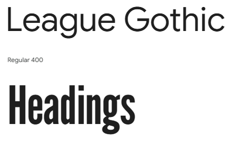

# Family Favourites

[View (website name) deployed site here.](https://dashboard.heroku.com/apps/family-favourites).

****

## Introduction

****

## Table of Contents

- [User Experience](#user-experience-ux)
- [Design](#design-choices)
- [Wireframes](#wireframes)
- [Features](#features)
- [Technologies Used](#technologies-used)
- [Testing](#testing)
- [Deployment](#deployment)
- [Credits](#credits-references)
- [Acknowledgements](#acknowledgements)

****

## User Experience UX

## Strategy

## Scope

### User Stories

### Epic A: Website Content

#### User Story A1: What kind of site

- As a first time user to the site I want to be able to see what kind of site it is and to navigate the site easily.

#### User Story A2: Location of the restaurant

- As a potential customer I want to be able to go to the restaurant and book a table at the restaurant.

#### User Story A3: Call the restaurant

- As a potential customer I want to be able to book, change and cancel a booking on the phone before visiting the restaurant.

#### User Story A4: Menu

- As a potential customer I want to browse the menu to see what is available before visiting the restaurant.

#### User Story A5: Reviews

- As a potential customer I want to read what people thought of the restaurant before I visit.

### Epic B: User Profile

#### User Story B1: Contact the Restaurant

- As a site user I want to be able to contact the restaurant via email.

#### User Story B2: Book a Table

- As a site user I want to be able to book a table at the restaurant online before going.

#### User Story B3: View my Booking

- As a site user I want to be able to view my bookings to show the booking has been made.

#### User Story B4: Change my Booking

- As a site user I want to be able to make changes to my booking in my account if necessary.

#### User Story B5: Cancel my Booking

- As a site user I want to be able to cancel my booking in my account if necessary.

#### User Story B6: Reviews

- As a customer I want to be able to write a review of how my meal and the service I received were.

#### User Story B7: Order a Meal

- As a site user I want to be able to order a meal online and either be able to pick it up or have it delivered to my door.

### Epic C: Admin Profile

#### User Story C1: Manage the Menus

- As a site admin I want to be able to create, read, update and delete the menus to make sure that the menus are current on the site.

#### User Story C2: Manage User Bookings

- As a site admin I want to be able to create, read, update and delete user bookings when required.

#### User Story C3: Approve Reviews

- As a site admin I want to be able to approve potential reviews from customers before they are displayed on the site.

### What a User may want

## Structure

### Database model

This Entity Relationship Diagram (ERD) has been generated using [Lucid Charts](https://lucid.app/documents#/home?folder_id=recent) - see below.

Entity Relationship Diagram

****

## Design choices

## Surface

### Colour

The colour palette I chose for the website came from the colour that I had chosen for the logo of Salome (#BBEEDD, rgb(187, 238, 221)). I then went onto the [mycolor.space](https://mycolor.space/?hex=%23BBEEDD&sub=1) website to create a colour palette for Salome, where I chose the Classy Palette, which I thought were nice soft colours which would not cause problems for people with colour blindness.

I then went to [Robert Cooper's](https://colornamer.robertcooper.me/) website to obtain the names of the colours that I had chosen and also their rgb values.

| Image with hex codes |  |
| --- | --- |
|rgb values | rgb(187, 238, 221), rgb(54, 75, 68), rgb(152, 176, 168), rgb(172, 202, 235), rgb(118, 148, 180) |
| Colour names | Salome, Garnet Black Green, Lovage Green, Baby Bunting, Ocean Ridge |

### Typography

I got my inspiration for the font from restaurants that I researched for this project and were chosen for their clear readability, which was found on [Google Fonts](https://fonts.google.com/selection?preview.layout=grid). The League Gothic font for the headings was inspired by [The Barn Owl](https://www.barnowlpubworcester.co.uk/) and by [The Swan](https://www.theswanmartinhussingtreepub.co.uk/) which are both Marston's pubs. The Roboto Slab font for the body of the site was inspired by the [Toby Carvery](https://www.tobycarvery.co.uk/restaurants/midlands/worcesterworcestershire#/). If the fonts should fail to load for any reason I have chosen Sans Serif as a backup.

| Image | Description |
| --- | --- |
|  | League Gothic for Headings |
|  | Roboto Slab for Body |

### Imagery

****

## Skeleton

## Wireframes

Below are the initial wireframes for my project.

- [Home page](readme_documents/wireframes/home-wireframe.png)
- [Menu page](readme_documents/wireframes/menu-wireframe.png)
- [Sign-up page](readme_documents/wireframes/signup-wireframe.png)
- [Login page](readme_documents/wireframes/login-wireframe.png)
- [Book a Table page](readme_documents/wireframes/book-a-table-wireframe.png)
- [Booking Contact Details page](readme_documents/wireframes/booking-contact-details-wireframe.png)

****

## Features

### Universal across the site

### Home

### About

### Gallery (images)

### Contact form (buttons)

### Footer

### Features to Implement in the Future

****

## Technologies Used

### Languages

- [HTML5](https://en.wikipedia.org/wiki/HTML5)
- [CSS3](https://en.wikipedia.org/wiki/CSS)
- [Python](https://www.python.org/)

### Frameworks, Libraries and Programs used

- [Visual Studio](https://visualstudio.microsoft.com/)
  - IDE and code editor used to build the game.
- [Google fonts]( https://fonts.google.com/)
  - To import font League Gothic and Roboto Slab onto the style.css file to be used on all pages. Also, Sans-serif and Serif were used as their fallbacks.
- [Font Awesome](https://fontawesome.com/)
  - To download the FF (Family Favourites) icon in svg format to create the favicon for the restaurant using the [favicon](https://favicon.io/) generator.
- [Git](https://git-scm.com/book/en/v2/Getting-Started-What-is-Git%3F)
  - Version Conrol System used to track changes in source code using the Gitpod terminal to commit messages and push to GitHub.
- [GitHub](https://github.com/)
  - GitHub was used to store the website after being pushed from Git.
- [Balsamiq]( https://balsamiq.com/)
  - Create wireframes for the layout of the site.
- [Lucidchart](https://www.lucidchart.com/pages/landing)
  - Used to create the Entity Relationship Diagram (ERD).
- [Bootstrap v5.3.8 CDN via jsDelivr bundle with Popper]( https://getbootstrap.com/)
  - Used for styling and make it more responsive.
- [NCH Software(Pixillion)](https://www.nchsoftware.com/imageconverter/index.html)
  - Used for reducing and converting the Family Favourites logo.
- [Django v4.2.24]( https://www.djangoproject.com/)
  - Used as a framework to create a rapid, clean and secure application development.
- [Django allauth](https://django-allauth.readthedocs.io/en/latest/index.html)
  - Used for account registration and authentication.
- [Django Crispy forms](https://django-crispy-forms.readthedocs.io/en/latest/)
  - Used for simplifying form rendering.
- [Phonenumbers](https://django-phonenumber-field.readthedocs.io/en/latest/index.html)
  - Used to add phone number field to form.
- [Heroku](https://www.heroku.com/)
  - Used for a cloud based deployment platform.
- [Heroku PostreSQL](https://www.heroku.com/postgres/)
  - Used as the database after the project was deployed into production.
- [SQLite](https://www.sqlite.org/index.html)
  - Used as a database before production deployment to Heroku.
- [Gunicorn](https://gunicorn.org/)
  - Used as the web server to run Django on Heroku.
- [Cloudinary](https://cloudinary.com/)
  - Used to store the images used in the application.
- [psycopg2](https://pypi.org/project/psycopg2/)
  - A database adapter used to support the connection to the Postgres db.
- [dj_database_url](https://pypi.org/project/dj-database-url/)
  - A library used to allow database urls to connect to the Postgres db.
- [Whitenoise](https://whitenoise.readthedocs.io/en/latest/)
  - Used to allow Heroku to serve its own static files.

- [Beautifier]( https://beautifier.io/)
- To uniform the layout by formatting the code for CSS and HTML.
- [Prettier]( https://prettier.io/)
- To uniform the layout by formatting the code for JavaScript.

## Testing

- [W3C Markup validator](https://validator.w3.org/)
- Testing the validity of html files.
- [W3C CSS validator](https://jigsaw.w3.org/css-validator/)
- Testing the validity of css files.
- [Am I Responsive]( https://ui.dev/amiresponsive)
- Checking the responsiveness of the website.
- Lighthouse tab within Chrome Developer Tools
- Testing the Performance, Accessibility, Best Practices and SEO of the site.
- [Page Speed](https://pagespeed.web.dev/)
- Used when Lighthouse didn’t work.

****

## Testing Performed

[View TESTME.md file](/TESTME.md)

****

## Deployment

### GitHub Pages

The site was deployed to GitHub Pages using the following steps:

1. Log in to GitHub and locate the [GitHub Repository](add the github link to the website).
2. Navigate to the "Settings" of the repository, located at the top of the page in the menu.
3. On the left-hand side is a menu and click on the "Pages" from the Code and Automation section.
4. Under "Branch" click on the dropdown menu called "None" and select "Main".
5. On the dropdown menu next to "Main" select "Root" and click the "Save" button.
6. Navigate to the "Code" of the repository, located at the top of the page in the menu.
7. On the right-hand side is an "About" section and below that is the "Deployments" which shows the GitHub pages that deployed.
8.

The live link can be found [here](add the live link to the website).

The site is hosted using GitHub pages and is deployed via the main branch. The deployed site uses a Version Control System to track changes in the source code using the Gitpod terminal to commit messages and push them to GitHub. This will update the repository automatically when GitHub receives these commits in the main branch. The main landing page of the site must be named index.html for the site to be deployed correctly, as the search engines are looking for this document to load the site onto the web.

### Cloning

To run the site locally, you can clone the repository into the code editor of your choice. As the code will be linked to my repository, any pushes you make from your repository will come to me for approval. This was not implemented using Gitpod but from my local computer using VS Code via Git to GitHub.

1. Log in to GitHub and locate the [GitHub Repository](add the github link to the website.git).
2. Click on the green code button above the list of files for the drop-down menu.
3. Select the preferred cloning method of HTTPS, SSH, or GitHub CLI and click on the copy button of the web URL to your clipboard.
4. Open Git Bash or Terminal
5. Change the current working directory to the one where you want the cloned directory (using cd).
6. In your IDE Terminal, type 'git clone' and paste the copied URL from your clipboard add the github link to the website.git e.g. https://github.com/Diane-4P/family-favourites.git.
7. When you press Enter your local clone has been created.
8. To then stop using the repository and cut ties with it you type 'git remote rm origin' into the terminal.

### Forking

When you fork a GitHub repository you will make a copy of it, which can be put into your own account, and you can make changes without affecting the original repository.

1. Log into GitHub and locate the GitHub Repository you want to fork.
2. At the top of the repository to the right, under the menu, there is a "Fork" button.
3. You should have a copy of the original repository in your own GitHub account.

****

## Credits (references)

- Code
  - [Bootstrap v5.3.8 CDN via jsDelivr bundle with Popper]( https://getbootstrap.com/) was used to create the cards for the about and forms. To use the dropdown button I also needed to include Popper with Bootstrap.
  - I also included the tabs from Bootstrap but it showed a lot of blank space which was removed by doing a Google search and copying the flexbox issue code provided by the AI overview to add to the CSS.
- Content
  - The about content was written by the developer. The menus were created from [Ye Olde Talbot](https://www.greenekinginns.co.uk/hotels/worcestershire/ye-olde-talbot) menus.
- Images
  - Favicon image used was created through the favicon generator from the initials of the applications created Family Favourites which gave us FF.
  - The main hero image was obtained from the [Bluebell Farm](https://www.farmhouseinns.co.uk/pubs/worcestershire/bluebell-farm) restaurants header image.

****

## Acknowledgements

- Mentor – Brian Macharia – for his helpful feedback
- Inspiration for website came from the following restaurants in Worcester:
  - [Ye Olde Talbot](https://www.greenekinginns.co.uk/hotels/worcestershire/ye-olde-talbot)
  - [The Swan](https://www.theswanmartinhussingtreepub.co.uk/)
  - [Bluebell Farm](https://www.farmhouseinns.co.uk/pubs/worcestershire/bluebell-farm)
  - [The Barn Owl](https://www.barnowlpubworcester.co.uk/)
  - [Harvester Timberdine](https://www.harvester.co.uk/restaurants/eastandwestmidlands/thetimberdineworcester#/)
  - [The Toby Carvery](https://www.tobycarvery.co.uk/restaurants/midlands/worcesterworcestershire#/)
  - [Ounce](https://ouncebar.co.uk/)

## Disclaimer

This site and content are for educational purposes only.
